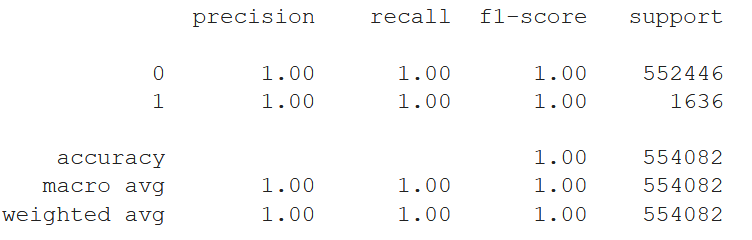

# Money_Transaction_Fraud_Detection

## Dataset Description

## Sample Dataset

## Dataset info [Kaggle]

## Types of Money Transaction

## Fraud Percent

## Flagged fraud percent

## Fraud Types [Money Transaction]

## Distribution Plot

## Confusion Matrix

## Classification Report

## Training time & Scores

